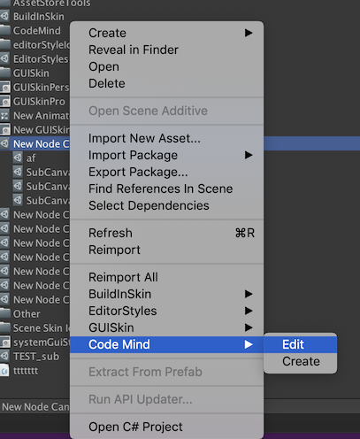
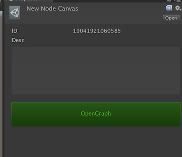
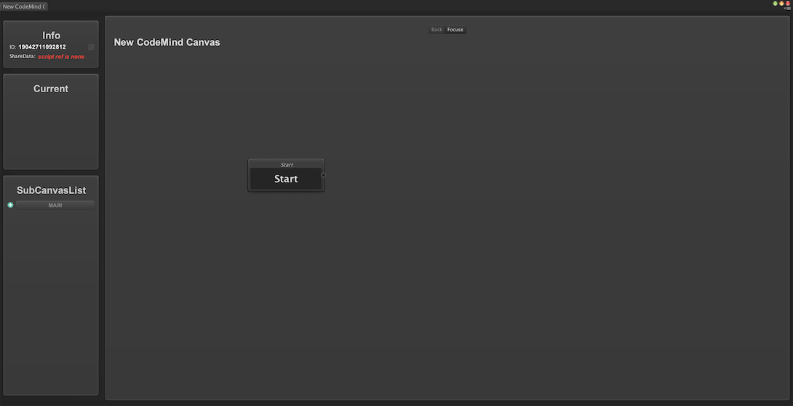
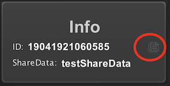
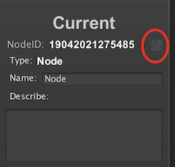
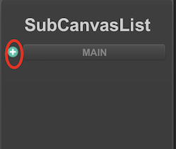
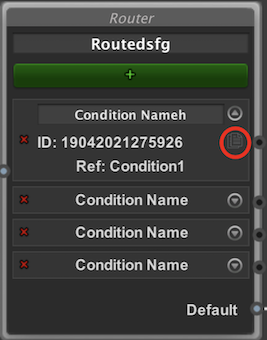
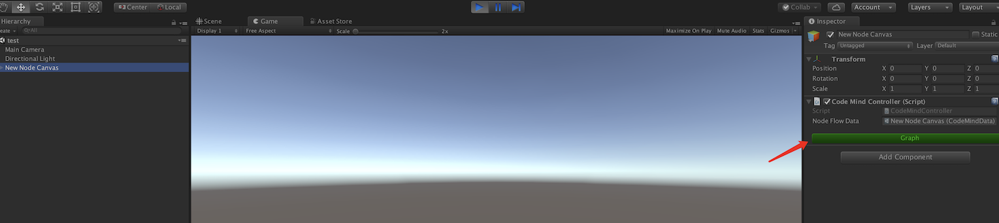
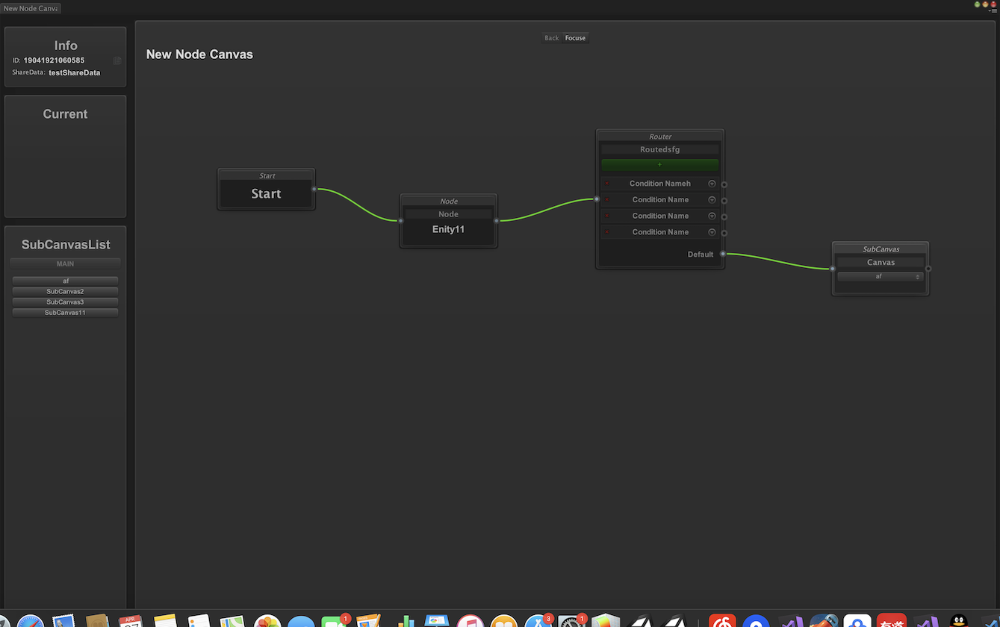

### Tag
Behaviour Tree
AI
Visual Script

### Creat a CodeMind Canvas
mouse right key and click a fold **Code Mind->Create.**


<br/>

### Edit the canvas

select the asset by mouse right key and click **Code Mind->Edit.**


<br/>

**OR**

click the button named **'OpenGraph'** in Inspector


<br/>

finally,you will see a window like this



<br/>

### Canvas Layout

+ **Info**
The canvas' infomation include id,sharedata
+ **Current**
The active node infomation include id,type,describe
+ **SubCanvasList**
The sub canvas array of the main canvas

<br/>

### Share Data
ShareData will cross throught the wholly period. You have to binding a specific script if you need,or else just do nothing.

***How to binding a script***
+ step1
Copy the canvas infomation by copy button in Info.

+ step2
Paste the infomation in your script header space.
```
[ShareDataBinding("19041921060585")]// you copy the canvas information
public class ShareDataTest : SharedData
{
    /*
     * your share data structure
    */
}
```

**Note:** the node script must derived from the class named 'SharedData'.

<br/>

### Start
It's the start point of current canvas. You do not anything for this ,cause auto create the one when generate a canvas.

<br/>

### Node
It's the most imptant node, will denote your behavour. You have to binding a specific script for it.

***How to binding a script?***
+ step1
Select the node you want to handle.

+ step2
Get the node information in **Current Window** by click the copy button.


+ step3
Paste the node information in your script's header space.
```
[NodeBinding("19041921060585", "19041923144744")]//you copy the node infomation
public class NodeTest : Node
{
    public NodeTest(SharedData data) : base(data) { }

    public override void execute()
    {
        /*
         * your code
         */

        //call finish method when current node finish you're sure
        finish(true);
    }
}
```

**Note:** the node script must derived from the class named 'Node'.

<br/>

### SubCanvas
This node will delegate a sub canvas you had create. At first the canvas contian some sub item.

***How to add a sub canvas***



<br/>

### Router

It's very important, it will decide which one is the next one. You can add a condition item by '+' button, and you must binding a specific script for every condition item.

***How to binding a condition script***
+ step1
Expand the condition item, copy the condition infomation by copy button.

+ step2
Paste the node information in your condition script's header space.
```
[RouterBinding("19041921060585", "19042021275763", "19042021275926")]// you copy the condition infomation
public class ConditionTest : RouterCondition
{
    public ConditionTest(SharedData data) : base(data) { }

    public override bool justify()
    {
        //get shared data
        testShareData data = shareData as testShareData;

        //return your result. True:passed False:refuse
        return data.state == 1;
    }
}
```

**Note:** the condition script must derived from the class named 'RouterCondition'.

<br/>

### Use it

API: $Instantiate$

```
public class test:MonoBehaviour
{
    public CodeMindData mindData;

    CodeMindController controller;
    private void Awake()
    {
        controller = mindData.Instantiate();
        controller.onFinish += Test_onFinish;
    }

    private void Test_onFinish(bool obj)
    {
        Debug.Log("State=>" + obj);
        //Destroy(controller.gameObject);
    }
}
```
<br/>

### Runntime state

After you instantiate a CodeMind item, you can click a 'Graph' button in Inspector.



<br/>

### Work Flow

+ step1
Designer finish the canvas by product’s logic mind
+ step2
Developer binding every node's script
+ step3
Run and check

**Note:** You can creat a circle flow, but I don't advocate that, cause it never stop.

<br/>

### Contact me

frank.wangqi@foxmail.com