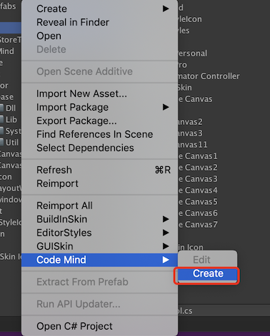

### Introduce

<strong>A simple logical flow design tool
A simple AI Script tool</strong>

<p>Normally it's diffcult to link every logic module in the game devlopement prograss,cause every single developer has different code style,
    so that we must definate so many interfaces,that will make thing complex.</p>

<strong>The tool will make things simple,you just take attention into the module logical functions,and it will link every module according your design.</strong>
<br/>

### Node Type
+ #### *Start*
     It's the start point of current canvas. You do not anything for this ,cause auto create the one when generate a canvas.
    
    <br/>

    

     <br/>

+ #### *Node*
    It's the most imptant node, that denote your behavour. You have to binding a specific script for it.

    <br/>

    

    **Note : Class of the Mono Script must derived from Node.**

    <br/>

    

    <br/>

    **Note : Invoke the method named 'moveNext' when you sure current node finished.**

    ```
    public class frankNode : Node
    {
        public string str;

        [Range(0,10)]
        public int index;

        protected override void OnNodeCreate(SharedData sharedData)
        {
            Debug.Log(">>>frankNode OnCreate");
        }

        //your node behavior
        protected override void OnNodePlay(SharedData sharedData)
        {
            Debug.Log(">>>>" + str);
            
            //move to next
            moveNext();
        }

        protected override void OnNodeDestroy(SharedData sharedData)
        {
            Debug.Log(">>>frankNode OnDelete");
        }
    }
    ```
<br/>

+ #### *Router*

    It's very important, it will decide which one is the next one. You can add a condition item by '+' button, and you must binding a specific script for every condition item.

    <br/>

    

    **Note : The condition script must derived from the class named 'RouterCondition'.**

    

    ```
    public class myCondition : RouterCondition
    {
        public string str;
        public int intValue;

        protected override void OnConditionCreate(SharedData shareData)
        {
            base.OnConditionCreate(shareData);
        }

        //your behavior
        public override bool Justify(SharedData sharedData)
        {
            return false;
        }

        protected override void OnConditionDestroy(SharedData shareData)
        {
            base.OnConditionDestroy(shareData);
        }
    }
    ```

<br/>

+ #### *SubCanvas*
    This node will delegate a another Code Mind asset.

    <br/>

    

<br>
### Flow Binding Data

<br/>


+ #### *Mode*
    + **once** : The flow run once.

    + **loop** : The flow run loop

+ #### *Shared Data*
    ShareData will cross throught the wholly period. You have to binding a specific script if you need.

    <br/>

    **Note: the node script must derived from the class named 'SharedData'.**

    ```
    public class testShareData : SharedData
    {
        public int state = 0;
        public string str = "sdf";

        protected override void OnDataCreate()
        {
            base.OnDataCreate();

            Debug.Log(">>>SharedData>>OnCreate");
        }

        protected override void OnDataDestroy()
        {
            base.OnDataDestroy();

            Debug.Log(">>>SharedData>>OnObjectDestroy");
        }
    }
    ```
<br/>

### Beginning

+ #### *Create/Edit*
    mouse right key and click a fold **Code Mind->Create.**
    

    <br/>

+ #### *Design your flow*
    

<br/>

+ #### *Run*
    $ API : Instantiate $
    ```
        CodeMindController controller;
        GameObject controllerGamobject;
        private void Awake()
        {
            controllerGamobject = mindData.Instantiate(out controller);
            controller.onFinish += Test_onFinish;
        }
    ```
<br/>

+ #### *Runtime view*
    Click the 'Graph' button.
    
    

    <br/>

    And you will see
    

<br/>

### Flow Check
+ Node : script asset can not be none , and must be valid.
+ Router :  script asset of every condition can not be none , and must be valid.
+ SubCanvas : The asset can not be none.

### Contact Me

frank.wangqi@foxmail.com